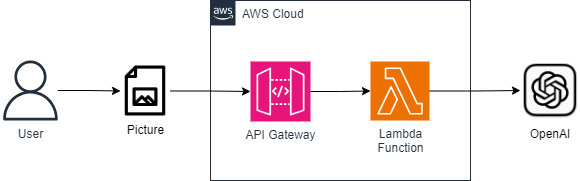

# Image Reading with OpenAI GPT-4V API in AWS

## About the Project

This project utilizes the OpenAI API for reading and interpreting images, providing insights into visual content. It is hosted on AWS, leveraging serverless services for scalability and efficiency. The development is done using AWS SAM to facilitate deployment and management of infrastructure as code.

## Architecture



## Prerequisites

To run this project, you will need:
- An AWS account
- AWS CLI configured
- SAM CLI installed
- Python 3.x installed
- Access to the OpenAI API

## Environment Setup

1. Clone the repository to your local machine:
```bash
git clone git@github.com:felipekiko/poc-ai-vision.git
cd poc-ai-vision
```

2. Create and configure your AWS and OpenAI credentials in the `.local/environment.json` file with the following structure:
```json
{
    "OpenAIVisionFunction": {
        "OPENAI_API_KEY": "YOUR OPENAI API KEY"
    }
}
```

3. Install the project dependencies:
```bash
pip install -r function/requirements.txt
```

## Running the Project

To run the project locally, use the SAM CLI:

- _.local/event.json_: Event data for the function
- _.local/environment.json_: Variables for the environment
```bash
sam local invoke -e .local/event.json -n .local/environment.json
```

## Deployment

To deploy the project to AWS, use the SAM CLI:

```bash
sam deploy --stack-name YOUR_STACK_NAME --capabilities CAPABILITY_IAM --s3-bucket YOUR_S3_BUCKET
```

## References

- AWS SAM: [GitHub](https://github.com/aws/serverless-application-model/blob/master/versions/2016-10-31.md)

## Contributing

Contributions are very welcome! If you have a suggestion for improvement or found a bug, feel free to open an issue or create a pull request.

1. Fork the project
2. Create your Feature Branch (`git checkout -b feature/NewFeature`)
3. Commit your changes (`git commit -m 'Add some NewFeature'`)
4. Push to the Branch (`git push origin feature/NewFeature`)
5. Open a Pull Request

## License

Distributed under the MIT License. See `LICENSE` for more information.

## Contact

Felipe KiKo - [@felipekiko](https://twitter.com/felipekiko) - felipe.kiko@gmail.com

Project Link: [https://github.com/felipekiko/poc-ai-vision](https://github.com/felipekiko/poc-ai-vision)
